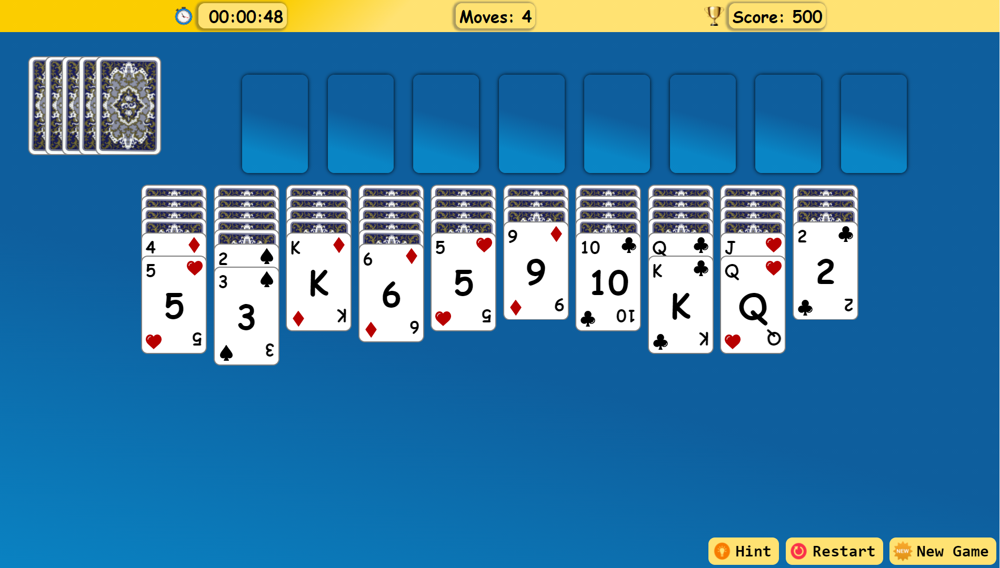
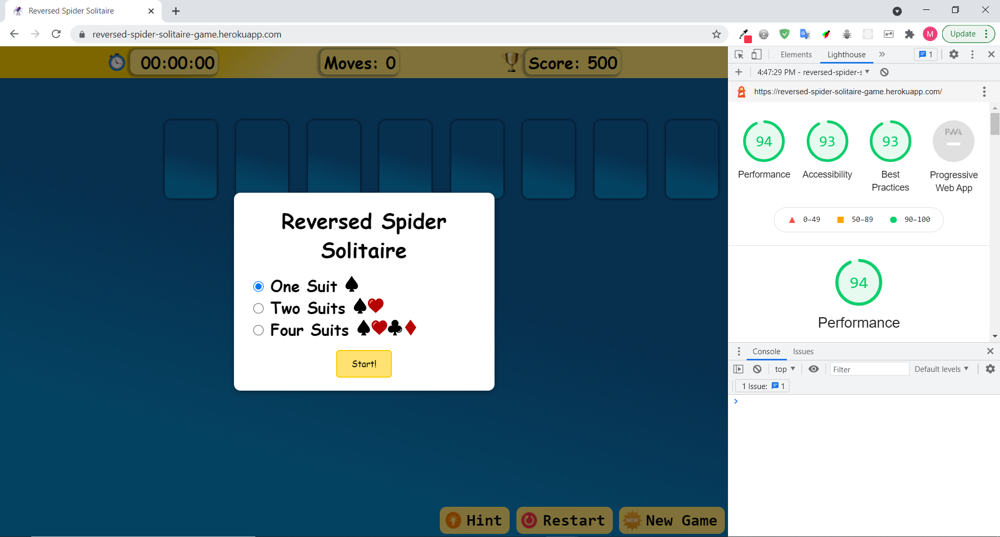
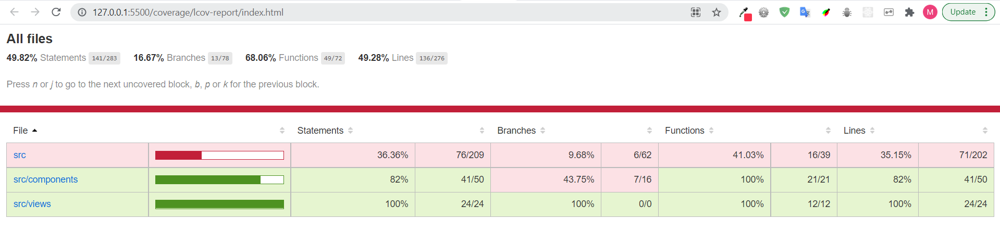
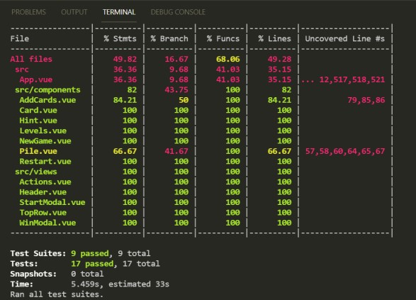
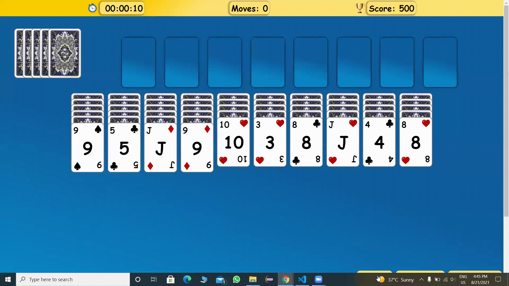
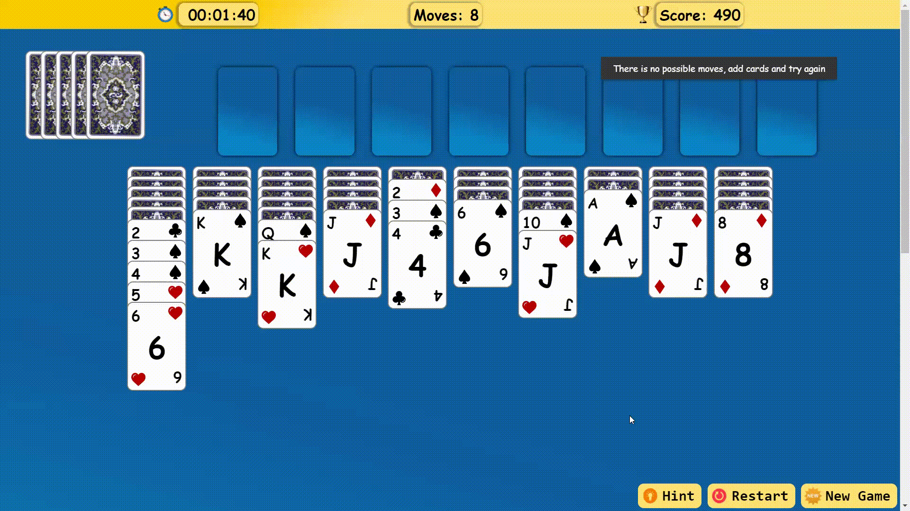
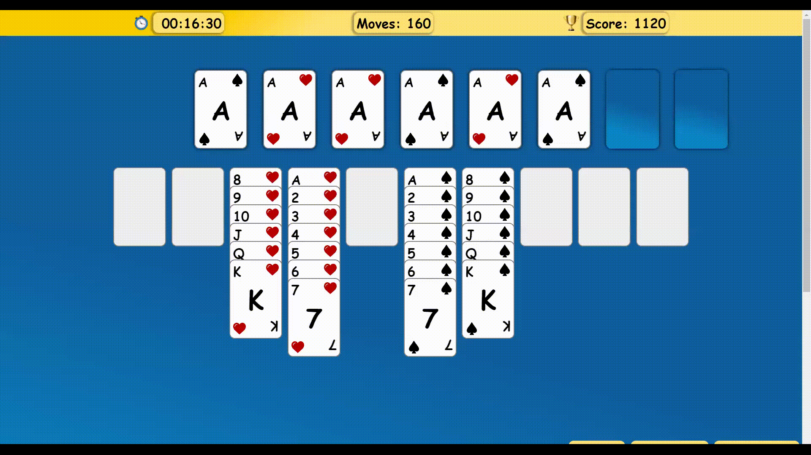
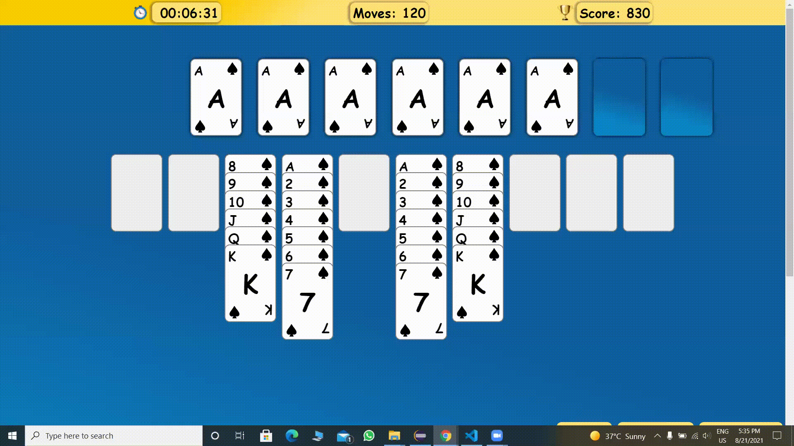
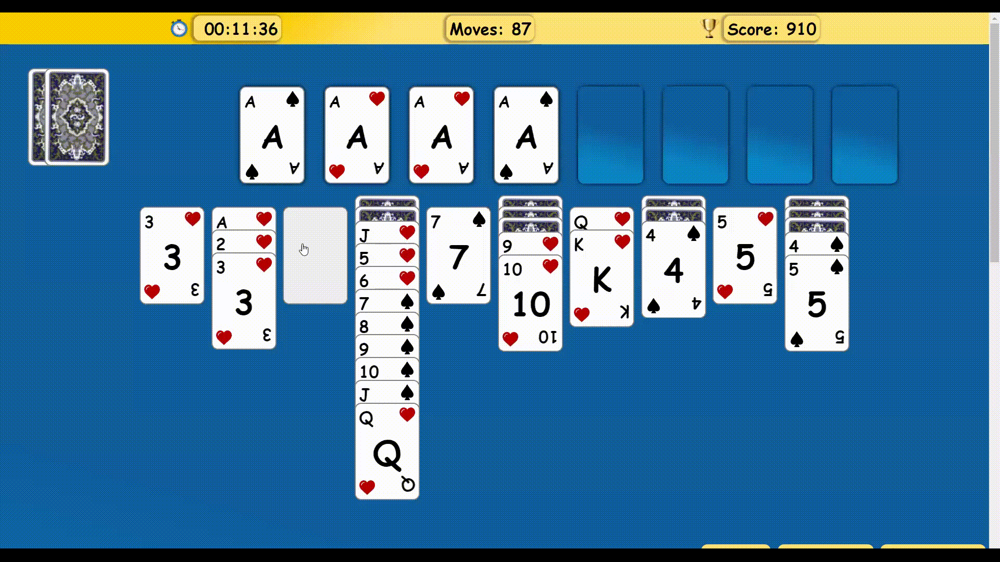

# Reversed Spider Solitaire

[Reversed Spider Solitaire](https://reversed-spider-solitaire-game.herokuapp.com/) It's a simple remake of classic Spider Solitaire Game built as the final project of Trendyol Front-End Bootcamp. 

[](https://reversed-spider-solitaire-game.herokuapp.com/)


## Content

- [Technologies Used](#technologies-used)
- [Installation](#installation)
- [How to Play](#how-to-play)
- [App Performance](#app-performance)
- [E2E Testing](#e2e-testing)
- [Unit Testing](#unit-testing)
- [CI/CD](#cicd)
- [Preview](#preview)
- [License](#license)
- [Links](#links)


## Technologies Used
- VueJS
- SASS
- Jest
- Cypress
- Heroku

## Installation
- Clone project
```sh
git clone https://github.com/mahmudmardini/reversed-spider-solitaire.git
```

``` bash
# install dependencies
npm install

# serve with hot reload at localhost:8080
npm run serve

# build for production with minification
npm run build
```

## How to Play 

### Wining the game
- The objective of this game is to arrange all of your cards of the same suit into piles from Ace to King
- You can move cards between piles by clicking on the cards you want to move
- You can either move one card, or several cards to another piles in order to sort them
- If you click on the cards at the top left of the screen, new cards will be dealed to each pile. Then you can use those new cards to keep sorting suits.
- When you sort all cards, that means you have won the game! 

### Scoring System
- Scoring system is related to the time you spend and the difficulty level you choose 
- You have 500 points in the begining of every new game and these points is reduced 10 points for every passing minute 
- The minimum score is ZERO
- You get 65 points for every sorted pile multiplied with the suit number you are playing with.<br>
 For example: if you play with 2 suits, you will get (65 * 2) 130 points for every sorted suit
- You have to sort 8 suits for each game, so in the end of the game you'll get (65 * 2 * 80) 1040 points
- Don't forget that you lose 10 points for every passing minute, so the faster you play the higher score you get 😉


## App Performance




## E2E Testing

All the components of this application has tested using [Cypress](https://docs.cypress.io/) End-to-End Testing Library
- run cypress tests
```sh
npx cypress open
```

## Unit Testing
- run unit tests
```sh
npm test
```




## CI/CD
This application is integrated and deployed automatically using [Heroku](https://www.heroku.com/) Cloud Platform


## Preview
### New Game

### Hint

### Hint Warning

### Two Suits Win

### One Suit Win

### Empty Pile Warning


## License

[MIT](https://github.com/mahmudmardini/reversed-spider-solitaire-mahmud-mardini/blob/main/LICENSE) © [Mahmud Mardini](https://github.com/mahmudmardini)

## Links

- [Play now!](https://reversed-spider-solitaire-game.herokuapp.com/)
- [Source code](https://github.com/mahmudmardini/reversed-spider-solitaire-mahmud-mardini)

